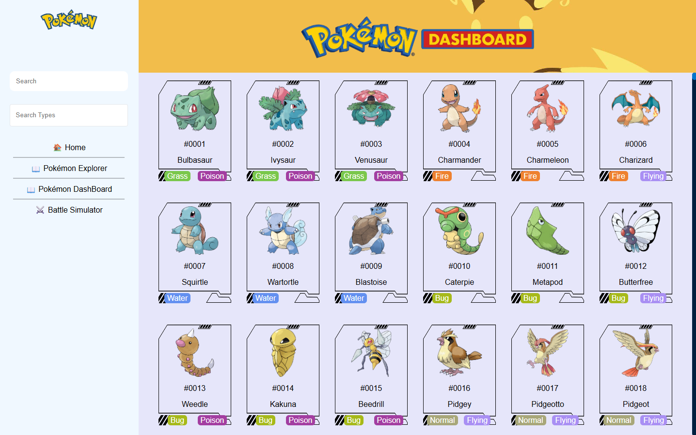

🐍 PokéDex Dash Board App – Version 1.6

A simple Python Dash Board using Flask to serve Pokémon data with sprite support and custom naming fixes.

---

Update: The iframe And jupyterlab was removed due to excessive html bloat. 
revert back to Version 1.4 to view its latest update

`git checkout 8f3519a`

---
Created by:
- **Rovic Magdamit (Rv Mdm)**
- **Justin Montealegre**
- **Majeed Haque (Seven)** 
- **James Gabata**
---

🚀 Quick Start

1. Setup Python Environment
----------------------------------
python -m venv venv
venv\Scripts\activate  # or source venv/bin/activate on Linux/Mac

2. Install Required Packages
----------------------------------
pip install -r requirements.txt

3. Run the App
----------------------------------
python main.py

The server will start at:
http://localhost:5000

---

🔁 Live Debugging / Auto Refresh

To enable auto-refresh during development, this app uses Live Server (Python-based, not browser plugin).

Install livereload if not yet installed:
pip install livereload

Then just run as normal:
python main.py

---

🌐 Share with Groupmates (Tunnel)

Use ngrok to expose your local server:
ngrok http 5000

---

❌ Free Port / Task Kill

If port 5000 is already in use, free it like this:

netstat -ano | findstr :5000
taskkill /PID <PID> /F

(Replace <PID> with the actual process ID)

---

📛 Naming Fixes & Notes

Some sprites need name correction for consistency:

Alola      → Alolan  
Galar      → Galarian  
Blastoise  → Blasoise (yes, seriously)  
Giratina   → Giratina Altered Forme  
Others     → Too many... good luck, future self

---

📂 Folder Structure (Quick Overview)

static/
    pokemon_sprites/
        0001 Bulbasaur.png

templates/
    base.html
    index.html

main.py  
requirements.txt  
README.md
